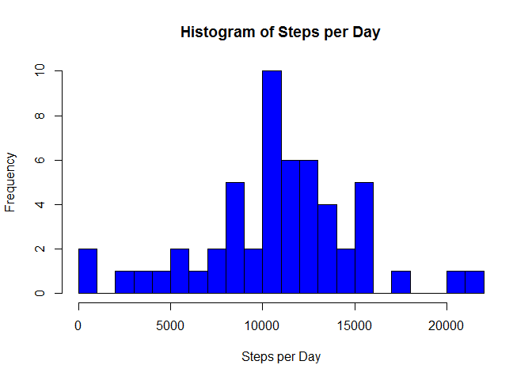
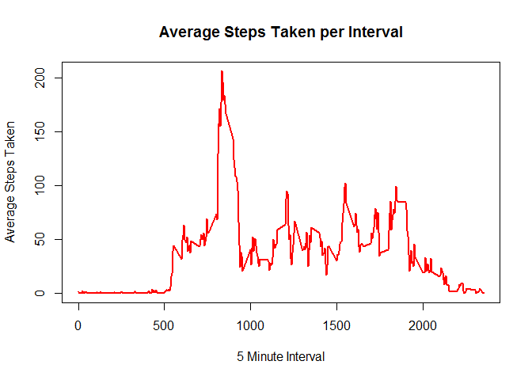
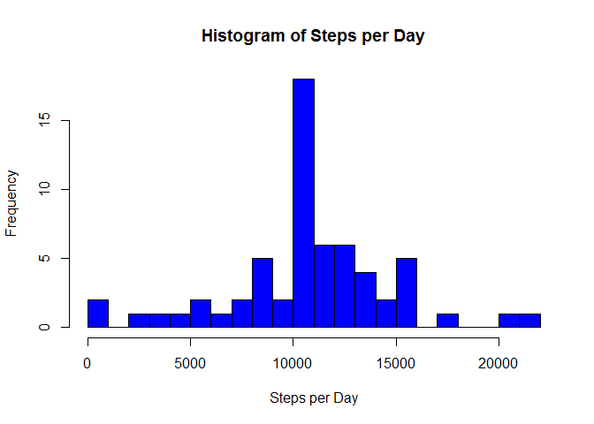
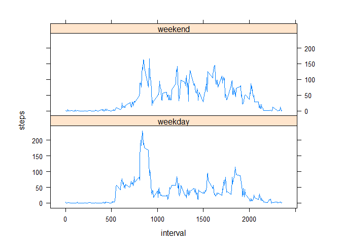

# Reproducible Data Course Project 1
James Shepherd  
May 13, 2016  
## Loading and Processing Data  
Data will be read in using read.csv() and the dates processed using the lubridate package (from a factor variable to a date variable). The suppressPackageStartupMessages() function is used to hide the loading messages that occur with packages.    

```r
suppressPackageStartupMessages(library(lubridate))
data <- read.csv("activity.csv")
data$date <- ymd(data$date)
```
  
## Histogram of Total Steps Taken per Day  
The dplyr package is used to filter out the missing values and group the steps by date, allowing a histogram to be plotted.  

```r
suppressPackageStartupMessages(library(dplyr))
steps <- data %>% 
         filter(!is.na(steps)) %>%
         group_by(date) %>%
         summarise(steps = sum(steps))
hist(steps$steps, xlab = "Steps per Day", main = "Histogram of Steps per Day", col = 4, breaks = 25)
```

<!-- -->
  
## Mean and Median Steps Taken per Day  
The mean and median steps taken by per day are calculated using Base R and set to ignore the missing values (as these would skew the results).  

```r
mean(steps$steps, na.rm = TRUE)
```

```
## [1] 10766.19
```

```r
median(steps$steps, na.rm = TRUE)
```

```
## [1] 10765
```
  
## Time Series of Average Number of Steps Taken  
The dplyr package will again be used to filter out missing values and this time will group observations using the interval they fall into, rather than the day they fall on. The average number of steps in each 5 minute interval is then plotted as a time series.  

```r
interval <- data %>%
            filter(!is.na(steps)) %>%
            group_by(interval) %>%
            summarise(steps = mean(steps))
plot(interval$interval, interval$steps, type = "l", xlab = "5 Minute Interval", ylab = "Average Steps Taken",   
     main = "Average Steps Taken per Interval", col = 2, lwd = 2)  
```

<!-- -->

```r
interval[which.max(interval$steps),]
```

```
## Source: local data frame [1 x 2]
## 
##   interval    steps
##      (int)    (dbl)
## 1      835 206.1698
```

## Inputing Missing Values  
Initially, it is shown that there are 2,304 missing values in the data set. The missing values are replaced with the mean number of steps in that interval across the rest of the data set. Finally, the data set is checked for missing values once again (and 0 are found).  

```r
sum(is.na(data$steps))
```

```
## [1] 2304
```

```r
filled_data <- data
missing_values <- is.na(filled_data$steps)
avg_int <- tapply(filled_data$steps, filled_data$interval, mean, na.rm = TRUE, simplyify = TRUE)
filled_data$steps[missing_values] <- avg_int[as.character(filled_data$interval[missing_values])]
sum(is.na(filled_data$steps))
```

```
## [1] 0
```
  
## Histogram of Total Steps per Day (No Missing Values)  
The histogram of steps taken per day is re-plotted with the msising values included.  

```r
steps_filled <- filled_data %>% 
         filter(!is.na(steps)) %>%
         group_by(date) %>%
         summarise(steps = sum(steps))
hist(steps_filled$steps, xlab = "Steps per Day", main = "Histogram of Steps per Day", col = 4, breaks = 25)
```

<!-- -->
  
## Weekend / Weekday Comparison of Average Number of Steps Taken per 5-minute Interval  
The weekdays are added into the data set (the one with no missing values) and then a factor variable is created that separates out weekend and weekday data, allowing a plot of each to be created. The graphs would indicate the activity tends to begin earlier on weekdays but that it is maintained steadily (and at a higher overall average level) throughout weekends.  

```r
filled_data$dayname <- weekdays(filled_data$date)
filled_data$weekend <- as.factor(ifelse(filled_data$dayname == "Saturday" |
                                 filled_data$dayname == "Sunday", "weekend", "weekday"))
library(lattice)
plot <- aggregate(steps ~ interval + weekend, filled_data, mean)
xyplot(steps ~ interval | factor(weekend), data=plot, aspect=1/3, type="l")
```

<!-- -->
